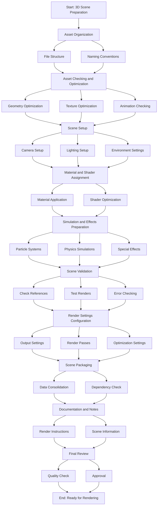

1. **Asset Organization**:
   - **File Structure**: Ensure that all assets (models, textures, animations, scripts, etc.) are organized in a well-structured directory hierarchy. This helps in easy referencing and minimizes the chances of missing files.
   - **Naming Conventions**: Use consistent and clear naming conventions for all assets to avoid confusion and ensure that all references are easily identifiable.

2. **Asset Checking and Optimization**:
   - **Geometry Optimization**: Clean up and optimize 3D models to reduce polygon count without sacrificing quality. This improves rendering performance.
   - **Texture Optimization**: Ensure textures are of appropriate resolution and format. Compress textures if necessary to reduce file sizes and improve loading times.
   - **Animation Checking**: Verify that all animations are properly linked and play correctly. Remove any unnecessary keyframes to streamline the animation data.

3. **Scene Setup**:
   - **Camera Setup**: Position and animate cameras as needed. Ensure that camera settings (e.g., focal length, depth of field) are correctly configured.
   - **Lighting Setup**: Place and configure lights to achieve the desired look. Ensure that light settings (e.g., intensity, color, shadows) are correctly set.
   - **Environment Settings**: Configure environment settings such as background images, HDRI maps, and atmospheric effects.

4. **Material and Shader Assignment**:
   - **Material Application**: Apply appropriate materials to all objects in the scene. Ensure that all material properties (e.g., diffuse, specular, bump maps) are correctly set.
   - **Shader Optimization**: Optimize shaders to ensure they render efficiently. Use simpler shaders where possible to reduce rendering times.

5. **Simulation and Effects Preparation**:
   - **Particle Systems**: Set up and configure any particle systems (e.g., smoke, fire, rain) used in the scene.
   - **Physics Simulations**: Prepare any physics simulations (e.g., cloth, fluids) and ensure they run correctly.
   - **Special Effects**: Prepare any additional special effects (e.g., volumetric lighting, lens flares) that need to be rendered.

6. **Scene Validation**:
   - **Check References**: Ensure all external references (e.g., linked models, textures) are correctly linked and accessible.
   - **Test Renders**: Perform low-resolution test renders to check for any issues with lighting, materials, or geometry. Make adjustments as needed.
   - **Error Checking**: Use software tools to check for common errors (e.g., missing textures, broken links, overlapping geometry) and resolve any issues found.

7. **Render Settings Configuration**:
   - **Output Settings**: Configure output settings such as resolution, frame rate, and file format.
   - **Render Passes**: Set up render passes (e.g., diffuse, specular, shadow) if needed for compositing.
   - **Optimization Settings**: Adjust render settings to balance quality and rendering time. This includes setting appropriate sampling rates, anti-aliasing, and other quality settings.

8. **Scene Packaging**:
   - **Data Consolidation**: Consolidate all scene data into a single package or directory. This may involve creating archive files or using specific scene packaging tools provided by the rendering software.
   - **Dependency Check**: Ensure all dependencies (textures, models, plugins) are included in the package to avoid missing assets during rendering.

9. **Documentation and Notes**:
   - **Render Instructions**: Prepare documentation or notes detailing any special instructions for rendering, including specific settings or steps to follow.
   - **Scene Information**: Include information about the scene setup, such as camera angles, lighting configurations, and material properties.

10. **Final Review**:
    - **Quality Check**: Conduct a final quality check to ensure everything is set up correctly and meets the desired standards.
    - **Approval**: If working in a team, get approval from relevant stakeholders (e.g., art director, client) before proceeding to rendering.

